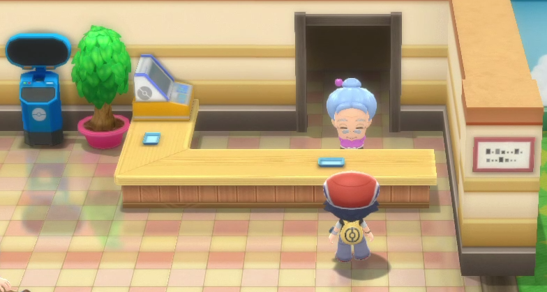

## Preface
- Set up Project_Xs
- Make sure you know how to find your state with blinks either manually or via screen capture
- You must have masuda method and/or shiny charm to rng for shininess
- Include gender ratio in pokefinder or you will not get correct results

## Steps
1. Set up pokefinder according to your parents information and your filters
2. Remove at least one parent from nursery/have your two parents ready to enter the nursery
3. Stand 1 tile away from being able to talk to the nursery lady (as seen below)

4. Use a super repel
5. Take 21 total steps going up one square then down one square 
    - You should end directly in front of the nursery lady
6. Deposit parents into daycare
7. Fly to your house and enter your room
8. Take steps in your room until the repel text comes up 
    - Make sure that you are facing down when the repel expires
    - If you are not facing down, then turn to face down and activate the "Theres a time and place for everything but not now" text box by using a key item

9. If the repel text is open then hover over "No"
10. Find your current state/advances with blinks
11. Find a target in pokefinder
12. As you approach your target advance, hold the down arrow
13. When you reach the target, hold A to close the text box and take a step
14. Head back to the daycare to collect your egg!
    - If there is no egg/the egg is not shiny, make sure that your parents info is correct in pokefinder and if so then find the advance you actually hit
    - If the advance you hit was near your target, account for the delay for your next attempt